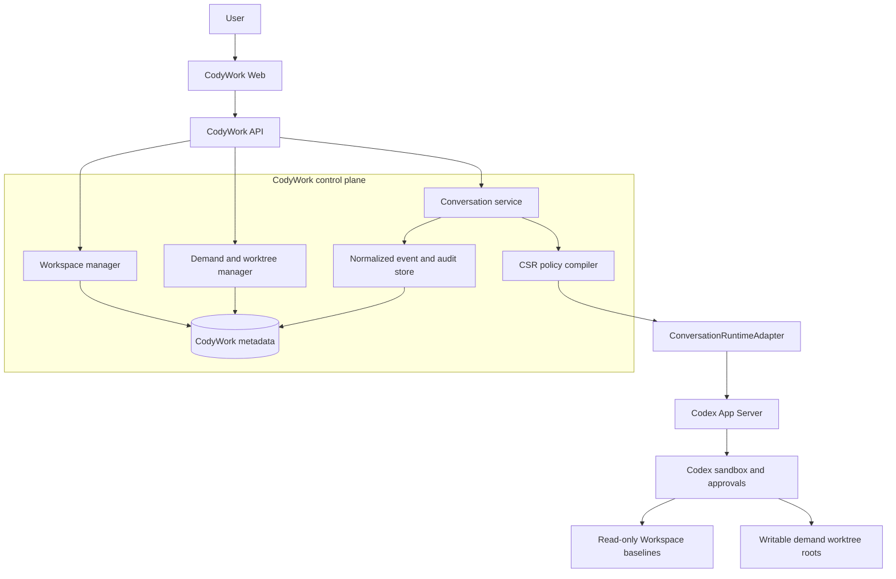

# CodyWork architecture

English | [中文](codywork-architecture.zh.md)

This document defines the architecture CodyWork ships today. CodyWork is the product control plane; Codex App Server is the only enabled agent runtime. The runtime protocol remains an internal seam so product code does not depend on provider-native event names, but the UI does not expose provider selection.

## Design rules

1. CodyWork owns Workspace registration, requirements, worktree lifecycle, policy compilation, conversation mappings, normalized events, and audit facts.
2. Codex owns the agent loop, native threads and turns, tool execution, approvals, and native transcript storage.
3. Instructions guide model behavior; effective policy and Codex sandbox configuration enforce filesystem and process authority.
4. Missing runtime or policy capabilities fail closed. CodyWork never falls back to a fake agent or widens access.
5. The filesystem is the source of truth for repositories, charters, knowledge, skills, worktrees, and generated changes.

## System boundary



## Workspace lifecycle

Workspace inspection is deterministic and happens before Codex starts:

| Inspection result | CodyWork action |
| --- | --- |
| Complete CSR Workspace | register and enter without mutation |
| Empty directory | ask Codex to initialize it, then inspect again |
| Non-empty incomplete directory | reject and explain what is missing |
| Git URL | clone, inspect, and apply the same rules |

The required top-level shape is `services/`, `docs/`, `specs/`, and `worktrees/`. `CONSTITUTION.md`, `AGENTS.md`, repository-local `AGENTS.md`, and `.agents/skills/` are instruction sources. Removing a Workspace removes only CodyWork registration unless the user explicitly requests filesystem deletion.

## Demand isolation

Each demand owns one directory:

```text
worktrees/<demand-key>/
├── services/<repo>/
└── docs/
```

The baseline `services/` repositories and Workspace policy documents are read-only during demand development. Writable roots are the selected demand repository worktrees and demand `docs/`. `yolo` removes per-operation approvals only inside those roots; it never grants machine-wide access.

## Runtime protocol

The internal protocol uses Conversation, Turn, Item, Approval, Question, Goal, Plan, Diff, and normalized events. A Codex conversation maps to a native thread. CodyWork stores the mapping, permission mode, policy and instruction hashes, event cursor, projections, and audit records; Codex remains the source of truth for native history.

The minimum event set includes message deltas, reasoning summaries, tool start/completion, turn lifecycle, approvals, questions, Goal/Plan projections, file changes, diffs, disconnects, and runtime failures. Raw native payloads may be retained only as diagnostic extensions.

## Codex mapping

| CodyWork | Codex App Server |
| --- | --- |
| Conversation | thread |
| Turn | turn |
| Item | item |
| Resume | `thread/resume` |
| Interrupt | `turn/interrupt` |
| Approval | native server request/response |
| Goal and Plan | native thread projections and collaboration mode |
| Files and diffs | native file-change and diff events |

The instruction bundle is sent as base/developer instructions. The effective policy is compiled into `cwd`, runtime roots, sandbox policy, writable roots, and approval policy. If the installed Codex version cannot express the required boundary, conversation creation fails.

## Runtime configuration

CodyWork starts `codex app-server --stdio` by default and reuses the local Codex login. The global settings page may override the command. CodyWork does not store a model API key and does not expose a provider selector. The connection test performs a real App Server initialization handshake.

## Failure semantics

- Workspace paths are canonicalized before comparison; symlink and traversal escapes are rejected.
- A failed or disconnected turn is never recorded as completed.
- Approval and question responses remain correlated with their conversation and native request.
- Runtime replacement disconnects in-flight sessions and requires native resume.
- No prompt, skill, charter, permission mode, or UI control can expand effective roots.

The detailed Dashboard and demand implementation contract is in the [CodyWork construction plan](codywork-construction-plan.md). The decision rationale is recorded in the [Codex-first runtime Agent Note](../.agents/notes/proposed/architecture/2026-08-22-codywork-codex-first-runtime.md).
