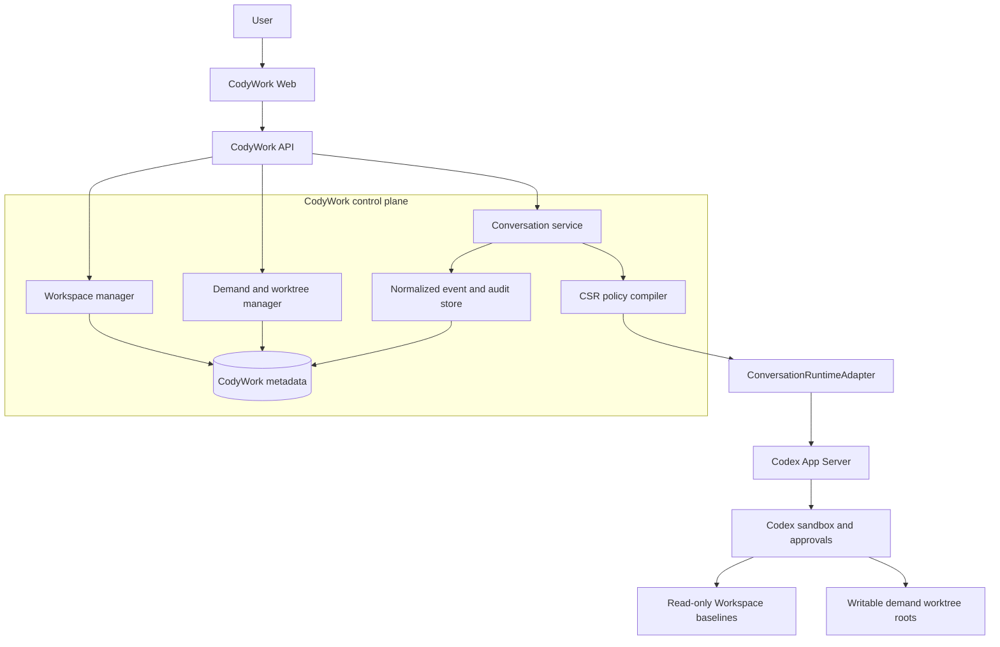

# CodyWork 架构

[English](codywork-architecture.md) | 中文

本文定义 CodyWork 当前实际交付的架构。CodyWork 是产品控制面，Codex App Server 是唯一启用的 Agent Runtime。内部仍保留 Runtime Protocol 作为隔离边界，避免产品代码依赖原生事件名，但 UI 不提供 Provider 选择。

## 设计规则

1. CodyWork 负责 Workspace 注册、需求、Worktree 生命周期、策略编译、Conversation 映射、标准事件和审计事实。
2. Codex 负责 Agent Loop、原生 Thread/Turn、工具执行、审批与原生会话日志。
3. Instructions 负责引导模型；Effective Policy 与 Codex Sandbox 负责真正的文件系统和进程权限。
4. Runtime 或策略能力不足时必须失败关闭，不能回退到 Fake Agent，也不能扩大权限。
5. 文件系统是 Repo、宪章、知识、Skills、Worktrees 与代码变更的事实来源。

## 系统边界



## Workspace 生命周期

CodyWork 会先确定性检查目录，再启动 Codex：

| 检查结果 | CodyWork 行为 |
| --- | --- |
| 完整 CSR Workspace | 不做修改，直接注册并进入 |
| 空目录 | 交给 Codex 初始化，再重新检查 |
| 非空但不完整 | 拒绝并明确缺少的结构 |
| Git URL | Clone 后检查，并应用相同规则 |

必要的顶层结构是 `services/`、`docs/`、`specs/` 和 `worktrees/`。`CONSTITUTION.md`、`AGENTS.md`、Repo 内 `AGENTS.md` 与 `.agents/skills/` 是 Instructions 来源。移除 Workspace 默认只删除 CodyWork 注册，不删除磁盘目录。

## 需求隔离

每个需求拥有独立目录：

```text
worktrees/<demand-key>/
├── services/<repo>/
└── docs/
```

需求开发时，Workspace 根 `services/` 下的基线 Repo 与 Workspace 策略文档只读。可写范围只包括已选 Repo 的需求 Worktree 与需求 `docs/`。`yolo` 只是在这些 Roots 内免逐次审批，永远不代表整机权限。

## Runtime Protocol

内部协议使用 Conversation、Turn、Item、Approval、Question、Goal、Plan、Diff 与标准事件。一个 Codex Conversation 对应一个原生 Thread。CodyWork 保存映射、权限模式、Policy/Instruction Hash、事件游标、Projection 与审计记录；原生历史仍以 Codex 为事实来源。

标准事件至少包含消息增量、推理摘要、工具开始/完成、Turn 生命周期、审批、问题、Goal/Plan Projection、文件变更、Diff、断连和 Runtime 失败。原生 Payload 只能作为诊断扩展保留。

## Codex 映射

| CodyWork | Codex App Server |
| --- | --- |
| Conversation | Thread |
| Turn | Turn |
| Item | Item |
| 恢复 | `thread/resume` |
| 中断 | `turn/interrupt` |
| 审批 | 原生 Server Request/Response |
| Goal 与 Plan | 原生 Thread Projection 与 Collaboration Mode |
| 文件与 Diff | 原生 File Change 与 Diff Event |

Instruction Bundle 映射为 Base/Developer Instructions；Effective Policy 映射为 `cwd`、Runtime Roots、Sandbox Policy、Writable Roots 与 Approval Policy。如果当前 Codex 版本无法表达所需边界，会话创建必须失败。

## Runtime 配置

CodyWork 默认启动 `codex app-server --stdio` 并复用本机 Codex 登录状态。全局设置页只允许覆盖启动命令。CodyWork 不保存模型 API Key，也不暴露 Provider 选择。连接测试会进行真实 App Server Initialize 握手。

## 失败语义

- Workspace 路径先 Canonicalize，再进行边界比较；拒绝 Symlink 与路径穿越逃逸。
- 失败或断连的 Turn 不能记为完成。
- Approval 与 Question Response 必须关联 Conversation 与原生 Request。
- Runtime 替换会断开正在运行的会话，随后必须通过原生 Resume 恢复。
- Prompt、Skill、宪章、权限模式或 UI 控件都不能扩大 Effective Roots。

Dashboard 与需求的详细实现合同见 [CodyWork 施工计划](codywork-construction-plan.md)，设计理由记录在 [Codex-first Runtime Agent Note](../.agents/notes/proposed/architecture/2026-08-22-codywork-codex-first-runtime.md)。
