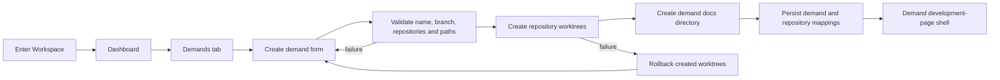

# CodyWork dashboard and demand construction plan

English | [中文](codywork-construction-plan.zh.md)

This plan defines the implementation order and acceptance contract for the first experience after entering a Workspace. It implements the control-plane responsibilities in the [CodyWork architecture](codywork-architecture.md) and follows the rationale in the [Codex-first Runtime proposal](../.agents/notes/proposed/architecture/2026-08-22-codywork-codex-first-runtime.md).

## Scope

The Workspace has two product tabs in this phase: Dashboard and Demands. Dashboard reports the five agreed metric groups. Demands lists all demands and creates a multi-repository development area that follows the life-csr directory model. A successful creation navigates to a demand development-page shell; the content and agent interaction on that page are outside this plan.

The server owns repository discovery, metric collection, branch validation, Git worktree creation, rollback, and metadata persistence as deterministic operations. An agent runtime does not decide or perform these control-plane mutations. The later demand development session receives only the validated demand directory and its exact read/write policy.

## Product flow



## Workspace layout

The baseline repositories remain under the Workspace-level `services/` directory. Each demand owns one path-safe worktree key. Its selected repositories are linked Git worktrees under `services/`, while its `docs/` directory holds demand-specific analysis and development records.

```text
<workspace>/
├── services/
│   ├── repo1/
│   └── repo2/
├── docs/
├── specs/
└── worktrees/
    └── <worktree-key>/
        ├── services/
        │   ├── repo1/
        │   └── repo2/
        └── docs/
```

The root `services/` repositories are baselines and remain read-only to demand agents. The exact writable roots for a demand are `worktrees/<worktree-key>/services/<repo>/` and `worktrees/<worktree-key>/docs/`, subject to the effective policy compiled for the selected runtime.

## Names and identifiers

| Value | Rule |
| --- | --- |
| Demand ID | CodyWork-generated stable identifier; never derived from a mutable name |
| Demand name | Required display value; trimmed, non-empty, unique within one Workspace while active |
| Branch name | Optional form value; generated from the demand name when absent; validated with `git check-ref-format --branch` |
| Generated branch | A deterministic lowercase slug of the demand name; collisions receive a short stable suffix |
| Worktree key | Path-safe projection of the branch name; a branch without `/` is unchanged and each `/` in a custom branch becomes `__` |
| Repository ID | Stable CodyWork identifier for one baseline repository under `services/` |

For example, a generated branch `coupon-rule` uses `worktrees/coupon-rule/`. A custom branch `feature/coupon-rule` uses `worktrees/feature__coupon-rule/` while Git retains the full `feature/coupon-rule` ref. The server rejects a key collision instead of sharing a demand directory.

## Data model

### `repositories`

| Field | Purpose |
| --- | --- |
| `id`, `workspace_id` | stable identity and owner |
| `name`, `baseline_path` | form label and canonical baseline directory |
| `origin_url`, `default_ref` | Git source and branch base |
| `sync_status`, `sync_error` | latest deterministic sync result: `ok` or `pull_failed` |
| `dirty`, `inspected_at` | latest local working-tree inspection |
| `present` | distinguishes a temporarily missing directory from a deleted registry row |

Repository discovery scans only first-level directories under `<workspace>/services`. A candidate must resolve inside that directory and pass `git rev-parse --show-toplevel`; nested repositories, symlink escapes, and unrelated directories are not selectable.

### `demands`

| Field | Purpose |
| --- | --- |
| `id`, `workspace_id` | stable identity and owner |
| `name`, `branch_name`, `worktree_key` | display, Git, and filesystem identities |
| `status` | `in_progress`, `completed`, or `blocked` |
| `created_at`, `updated_at` | ordering and display timestamps |

A demand becomes visible only after every selected repository worktree and the demand `docs/` directory exist. New demands start as `in_progress`. Status-changing interactions belong to the later development-page design; the schema supports the Dashboard counts without adding that UI in this phase.

### `demand_repositories`

| Field | Purpose |
| --- | --- |
| `demand_id`, `repository_id` | many-to-many ownership |
| `branch_name`, `worktree_path` | exact Git ref and canonical linked-worktree path |
| `base_ref`, `base_commit` | immutable comparison base captured before creation |
| `created_at` | audit timestamp |

The database enforces uniqueness for `(demand_id, repository_id)`, `(repository_id, branch_name)`, and `worktree_path` so two active demands cannot claim the same repository branch or directory.

### `demand_operations`

This internal journal records creation attempts before the first filesystem mutation. It stores the request, completed repository steps, terminal result, and error. Startup reconciliation uses incomplete entries to remove or report orphaned linked worktrees. Operation rows do not appear as product demands and do not affect Dashboard demand counts.

## Dashboard metrics

`GET /api/workspaces/:workspaceId/dashboard` returns one snapshot with a `generatedAt` timestamp and independent error information for each metric group. One failed collector does not erase the last valid results of the others.

| Group | Fields | Definition |
| --- | --- | --- |
| Demands | `total`, `inProgress`, `completed`, `blocked` | Count persisted demands in the current Workspace by status; `total` is their sum |
| Repositories | `total`, `normal`, `dirty`, `pullFailed` | Count registered present baseline repositories; classification priority is `pullFailed`, then `dirty`, then `normal`, so the three states sum to `total` |
| Code changes | `additions`, `deletions`, `filesChanged` | Aggregate every registered demand worktree against its captured `base_commit`, including committed, staged, unstaged, and untracked changes |
| Knowledge | `documents`, `lastUpdatedAt` | Recursively count regular knowledge files under the Workspace-level `docs/`; use the newest modification time or `null` when empty |
| Skills | `available`, `disabled`, `loadFailed` | Count skills discovered for this Workspace using runtime-adapter skill inspection and CodyWork configuration |

Dashboard rendering is read-only. It never runs `git pull`. `pullFailed` reflects the most recent explicit or lifecycle-triggered baseline synchronization attempt and remains until a later successful sync. Repository dirtiness comes from porcelain Git status, not from the sync result.

Code metrics compare each demand repository with the `base_commit` captured at creation, so commits made on the demand branch remain visible. Binary changes contribute to `filesChanged` but not line counts. Renames count as one changed file. Untracked text files contribute line counts; unreadable or binary untracked files contribute only to `filesChanged`. The same canonical file is counted once per demand worktree.

Knowledge metrics cover `<workspace>/docs/` only. Demand-local `worktrees/<worktree-key>/docs/` content is not knowledge-base content until a later explicit knowledge-return workflow promotes it.

Skill metrics distinguish filesystem discovery from successful runtime loading. `available` means Codex can load the skill, `disabled` means CodyWork or Workspace configuration excludes it, and `loadFailed` means discovery succeeded but parsing, dependency validation, or runtime registration failed. An unavailable runtime returns a collector error instead of reclassifying every skill as failed.

## HTTP API

| Method and path | Result |
| --- | --- |
| `GET /api/workspaces/:workspaceId/dashboard` | current Dashboard snapshot |
| `POST /api/workspaces/:workspaceId/dashboard/refresh` | run collectors and return the refreshed snapshot; no repository pull |
| `GET /api/workspaces/:workspaceId/repositories` | selectable baseline repositories and their current status |
| `GET /api/workspaces/:workspaceId/demands` | all persisted demands ordered by most recent update |
| `POST /api/workspaces/:workspaceId/demands` | validate and atomically create one demand and all selected worktrees |
| `GET /api/workspaces/:workspaceId/demands/:demandId` | demand metadata and repository mappings for the development-page shell |

The demand creation request and successful response use this minimum shape:

```json
{
  "name": "Coupon rule optimization",
  "branchName": "feature/coupon-rule",
  "repositoryIds": ["repo_1", "repo_2"]
}
```

```json
{
  "id": "demand_1",
  "name": "Coupon rule optimization",
  "status": "in_progress",
  "branchName": "feature/coupon-rule",
  "worktreeKey": "feature__coupon-rule",
  "directory": "<workspace>/worktrees/feature__coupon-rule",
  "repositories": [
    {
      "id": "repo_1",
      "name": "repo1",
      "worktreePath": "<workspace>/worktrees/feature__coupon-rule/services/repo1"
    }
  ]
}
```

Validation errors use stable codes such as `invalid-demand-name`, `invalid-branch`, `repository-not-found`, `repository-not-git`, `branch-in-use`, `worktree-path-conflict`, and `worktree-create-failed`. A failure response includes per-repository detail but never exposes arbitrary command output or credentials.

## Demand creation transaction

The server serializes demand creation per Workspace and performs these steps:

1. Canonicalize the Workspace, baseline repository, demand root, and target worktree paths; reject any path outside its expected root.
2. Validate the demand name, resolve or generate the branch name, derive the worktree key, and reject database or filesystem collisions.
3. Resolve every selected repository from the current Workspace registry; reject an empty selection, duplicates, missing repositories, non-Git roots, and symlink escapes.
4. Capture each repository's `default_ref` and `base_commit`; verify the requested branch is not already checked out in another linked worktree.
5. Write a `demand_operations` journal entry containing the complete plan before creating directories or Git refs.
6. Create `worktrees/<worktree-key>/services/` and add one linked worktree per repository. A new branch uses `git worktree add -b <branch> <path> <base-ref>`; an existing reusable branch uses `git worktree add <path> <branch>` only after the same safety checks.
7. Create `worktrees/<worktree-key>/docs/` after all repository worktrees succeed.
8. In one database transaction, insert the demand and every demand-repository mapping, then mark the operation complete.
9. Reinspect every resulting path and return the persisted demand only when directory, branch, and repository mappings agree.

If any step fails, the server removes only linked worktrees and directories recorded by that operation, prunes Git worktree metadata where required, and leaves baseline repositories unchanged. The generated Git branches remain only when removal would destroy commits not created by the operation; the error reports that manual cleanup is required. A database commit failure runs the same compensating cleanup. Startup reconciliation handles a process exit between filesystem mutation and database commit.

## Frontend construction

The selected Workspace becomes the navigation root. Its sidebar shows only Dashboard and Demands for this phase; Workspace switching and Workspace management remain accessible through the existing switcher.

### Dashboard tab

Render five metric cards or sections in the agreed order: Demands, Repositories, Code changes, Knowledge documents, and Skills. Each shows the exact fields defined above, its snapshot time, a loading state, an empty state, and an isolated error state. The page uses one Dashboard endpoint rather than assembling metrics through five browser requests.

### Demands tab

Render all demands with name, status, branch, selected repository names, code-change summary when available, and last update time. The only primary action in this phase is Create demand. Clicking a row opens the demand development-page shell.

### Create demand form

The modal contains demand name, optional branch name, and a required multi-select of available repositories. The UI previews the generated branch and worktree directory when the branch is omitted. Submission remains disabled until the name and at least one repository are valid. While creation runs, the modal prevents duplicate submission and shows repository-level progress returned by the server. A failure keeps the form values and presents the stable error plus the affected repository; success closes the modal, refreshes Dashboard and Demands state, and navigates to the new demand shell.

The browser does not generate the authoritative branch name or worktree path. Its preview uses the same response contract, while the server returns and persists the final values.

## Implementation stages

### Stage 1: persistence and repository inventory

Add the repository, demand, demand-repository, and operation-journal migrations to the CodyWork database. Implement repository discovery, canonical-path checks, Git status inspection, sync-result persistence, and startup reconciliation. Expose repository listing before building the form so every later layer uses stable repository IDs.

Exit criteria: two baseline Git repositories under `services/` are discovered after restart with stable IDs; non-Git directories and symlink escapes are excluded; dirty and sync-failure states survive long enough to render a deterministic snapshot.

### Stage 2: Dashboard collectors and API

Implement independent collectors for demand counts, repository classification, worktree diffs, Workspace knowledge files, and adapter-reported skills. Add snapshot caching and the Dashboard read/refresh routes. A collector failure returns its own error and preserves other groups.

Exit criteria: fixtures produce exact counts for every field; opening or refreshing Dashboard does not mutate repositories; committed and uncommitted worktree changes are both reflected against the captured base.

### Stage 3: demand creation service

Implement name and branch normalization, preflight validation, the per-Workspace creation lock, operation journaling, multi-repository `git worktree` execution, demand docs creation, database commit, compensating rollback, and restart reconciliation. Keep Git command execution behind one typed service so route handlers do not assemble commands.

Exit criteria: one demand selects two repositories and produces the required directory tree and branch in both repositories; every injected failure point either leaves no visible demand and no orphaned worktree or produces an explicit recoverable operation error.

### Stage 4: Workspace UI

Replace the generic current-Workspace page with Dashboard and Demands navigation. Add the five Dashboard modules, demand list, create modal, repository selection, generated-name preview, progress/error handling, and demand shell navigation. Preserve existing Workspace switch/create/remove behavior.

Exit criteria: a user can open a Workspace, read all five metric groups, create a multi-repository demand, see it in the list and Dashboard count, and land on its development-page shell without a full-page reload.

### Stage 5: hardening and acceptance

Run cross-platform Git fixtures, concurrent submission tests, path and symlink attack tests, crash-recovery tests, API contract tests, component tests, and one browser end-to-end flow. Add structured audit events for demand creation start, per-repository completion, rollback, and final success without logging credentials or repository contents.

Exit criteria: the acceptance matrix below passes and no product-visible partial demand can be created.

## Acceptance matrix

| Scenario | Required result |
| --- | --- |
| Workspace with no demands | Dashboard shows demand zeros and an empty demand list |
| Clean, dirty, and failed-sync repositories | Repository totals use the documented exclusive classification |
| Worktree with committed, staged, unstaged, untracked, renamed, and binary changes | Code totals follow the documented base and counting rules |
| Empty knowledge directory | `documents` is `0` and `lastUpdatedAt` is `null` |
| Available, disabled, malformed, and runtime-unavailable skills | the first three classify correctly; runtime unavailability is a collector error |
| Demand without a branch value | server generates and returns a valid unique branch and matching worktree key |
| Demand with `feature/name` | Git uses the full ref and the directory uses the path-safe key |
| Two selected repositories | both linked worktrees exist under one demand `services/` directory and use the same branch name |
| Second repository creation fails | first worktree is rolled back, no demand is visible, and retry is safe |
| Existing branch is checked out elsewhere | preflight rejects before any mutation |
| Duplicate submission | one operation succeeds and the other receives a deterministic conflict |
| Server exits during creation | startup reconciliation identifies and cleans or reports the incomplete operation |
| Workspace switch | Dashboard and demands always resolve from the selected Workspace ID |

## Deferred work

The demand development conversation, Agent Runtime session creation, Goal, Plan, approvals, permission modes, and the WebSocket event stream are implemented in this delivery. SDD, demand status controls, demand deletion, post-completion worktree cleanup, knowledge return, fine-grained Skill management, and Dashboard activity/health panels remain deferred. The present API and data model expose stable demand directories, repository mappings, base commits, and status fields so later work can build on them without changing the creation contract.
