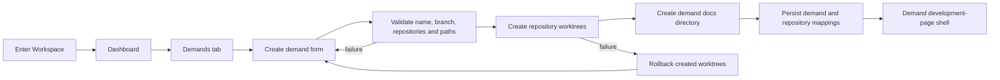

# CodyWork Dashboard 与需求施工计划

[English](codywork-construction-plan.md) | 中文

本文定义进入 Workspace 后第一阶段体验的实现顺序与验收合同，落实 [CodyWork 架构](codywork-architecture.md)中的控制面职责，并遵循 [Codex-first Runtime 提案](../.agents/notes/proposed/architecture/2026-08-22-codywork-codex-first-runtime.md)记录的设计理由。

## 范围

本阶段的 Workspace 只有两个产品 Tab：Dashboard 和需求。Dashboard 展示已经确认的五组指标；需求 Tab 展示全部需求，并按照 life-csr 目录模型创建包含多个 Repo 的开发区。创建成功后进入需求开发页壳子；开发页的内容和 Agent 交互不在本计划范围内。

服务端把 Repo 发现、指标采集、分支校验、Git Worktree 创建、失败回滚和元数据持久化作为确定性操作负责。Agent Runtime 不决定也不执行这些控制面变更。后续需求开发会话只接收已经验证的需求目录及其精确读写策略。

## 产品流程



## Workspace 目录

基线 Repo 保留在 Workspace 根目录的 `services/` 下。每个需求拥有一个路径安全的 Worktree Key，选中的 Repo 以 Git Linked Worktree 形式放在需求目录的 `services/` 下，`docs/` 保存需求级分析与开发记录。

```text
<workspace>/
├── services/
│   ├── repo1/
│   └── repo2/
├── docs/
├── specs/
└── worktrees/
    └── <worktree-key>/
        ├── services/
        │   ├── repo1/
        │   └── repo2/
        └── docs/
```

根目录 `services/` 是基线 Repo，对需求 Agent 保持只读。需求的精确可写目录是 `worktrees/<worktree-key>/services/<repo>/` 与 `worktrees/<worktree-key>/docs/`，最终由所选 Runtime 编译出的 Effective Policy 约束。

## 名称与标识

| 值 | 规则 |
| --- | --- |
| Demand ID | CodyWork 生成的稳定标识，不从可修改的需求名派生 |
| 需求名 | 必填展示值；去除首尾空白后非空，在同一 Workspace 的活跃需求中唯一 |
| 分支名 | 表单选填；为空时按需求名生成；使用 `git check-ref-format --branch` 校验 |
| 自动分支名 | 需求名确定性转换的小写 Slug；冲突时添加短稳定后缀 |
| Worktree Key | 分支名的路径安全投影；不含 `/` 时保持不变，自定义分支中的每个 `/` 转换为 `__` |
| Repository ID | `services/` 下一个基线 Repo 的稳定 CodyWork 标识 |

例如，自动分支 `coupon-rule` 使用 `worktrees/coupon-rule/`；自定义分支 `feature/coupon-rule` 使用 `worktrees/feature__coupon-rule/`，Git 中仍保留完整的 `feature/coupon-rule` Ref。Key 冲突时服务端拒绝创建，不让两个需求共享目录。

## 数据模型

### `repositories`

| 字段 | 用途 |
| --- | --- |
| `id`、`workspace_id` | 稳定标识与所属 Workspace |
| `name`、`baseline_path` | 表单展示名与规范化基线目录 |
| `origin_url`、`default_ref` | Git 来源与分支基线 |
| `sync_status`、`sync_error` | 最近一次确定性同步结果：`ok` 或 `pull_failed` |
| `dirty`、`inspected_at` | 最近一次本地 Working Tree 检查 |
| `present` | 区分暂时缺失的目录与已删除的注册记录 |

Repo 发现只扫描 `<workspace>/services` 下的一级目录。候选目录必须解析在该目录内部并通过 `git rev-parse --show-toplevel`；嵌套 Repo、符号链接逃逸和无关目录不可选。

### `demands`

| 字段 | 用途 |
| --- | --- |
| `id`、`workspace_id` | 稳定标识与所属 Workspace |
| `name`、`branch_name`、`worktree_key` | 展示、Git 与文件系统标识 |
| `status` | `in_progress`、`completed` 或 `blocked` |
| `created_at`、`updated_at` | 排序和展示时间 |

只有全部选中 Repo Worktree 与需求 `docs/` 目录都存在后，需求才对产品可见。新建需求初始为 `in_progress`。状态修改交互属于后续开发页设计；本期只让 Schema 支持 Dashboard 统计，不额外增加状态 UI。

### `demand_repositories`

| 字段 | 用途 |
| --- | --- |
| `demand_id`、`repository_id` | 多对多归属 |
| `branch_name`、`worktree_path` | 精确 Git Ref 与规范化 Linked Worktree 路径 |
| `base_ref`、`base_commit` | 创建前捕获且不可变的对比基线 |
| `created_at` | 审计时间 |

数据库对 `(demand_id, repository_id)`、`(repository_id, branch_name)` 与 `worktree_path` 建唯一约束，避免两个活跃需求占用同一个 Repo 分支或目录。

### `demand_operations`

这个内部日志在第一次文件系统变更前记录创建尝试，保存请求、已完成的 Repo 步骤、最终结果与错误。启动时的 Reconciliation 使用未完成记录清理或报告孤立 Linked Worktree。Operation 不作为产品需求展示，也不进入 Dashboard 的需求统计。

## Dashboard 指标

`GET /api/workspaces/:workspaceId/dashboard` 返回一个带 `generatedAt` 的快照，每组指标有独立错误信息。一个 Collector 失败不能清空其他 Collector 的最近有效结果。

| 分组 | 字段 | 定义 |
| --- | --- | --- |
| 需求 | `total`、`inProgress`、`completed`、`blocked` | 按状态统计当前 Workspace 的持久化需求；`total` 是三种状态之和 |
| Repo | `total`、`normal`、`dirty`、`pullFailed` | 统计已注册且存在的基线 Repo；分类优先级为 `pullFailed`、`dirty`、`normal`，三者之和等于 `total` |
| 代码变更 | `additions`、`deletions`、`filesChanged` | 每个已注册需求 Worktree 相对其 `base_commit` 聚合，包含已提交、Staged、Unstaged 与 Untracked 变更 |
| 知识文档 | `documents`、`lastUpdatedAt` | 递归统计 Workspace 根级 `docs/` 下的普通知识文件；取最新修改时间，无文件时为 `null` |
| Skills | `available`、`disabled`、`loadFailed` | 通过 Runtime Adapter 的 Skill 检查与 CodyWork 配置统计当前 Workspace 的 Skills |

Dashboard 渲染是只读操作，绝不执行 `git pull`。`pullFailed` 表示最近一次显式或生命周期触发的基线 Repo 同步失败，并保持到下一次同步成功。Repo 是否 Dirty 由 Porcelain Git Status 判断，与同步结果相互独立。

代码指标以需求创建时捕获的 `base_commit` 为基线，因此需求分支上已经提交的代码仍然计入。二进制变更只增加 `filesChanged`，不增加行数；Rename 计为一个文件；Untracked 文本文件计入行数，不可读或二进制 Untracked 文件只增加文件数；同一规范化文件在一个需求 Worktree 中只计一次。

知识指标只覆盖 `<workspace>/docs/`。需求目录 `worktrees/<worktree-key>/docs/` 的内容在后续显式知识回流流程提升之前，不属于知识库统计。

Skill 指标区分文件发现与 Runtime 成功加载。`available` 表示 Codex 可以加载，`disabled` 表示被 CodyWork 或 Workspace 配置排除，`loadFailed` 表示已经发现但解析、依赖验证或 Runtime 注册失败。Runtime 不可用时返回 Collector Error，不把所有 Skill 错误归为加载失败。

## HTTP API

| Method 与 Path | 结果 |
| --- | --- |
| `GET /api/workspaces/:workspaceId/dashboard` | 当前 Dashboard 快照 |
| `POST /api/workspaces/:workspaceId/dashboard/refresh` | 运行 Collector 并返回刷新后的快照；不执行 Repo Pull |
| `GET /api/workspaces/:workspaceId/repositories` | 可选基线 Repo 及其当前状态 |
| `GET /api/workspaces/:workspaceId/demands` | 按最近更新时间排序的全部持久化需求 |
| `POST /api/workspaces/:workspaceId/demands` | 校验并原子创建一个需求及其全部 Worktree |
| `GET /api/workspaces/:workspaceId/demands/:demandId` | 提供给开发页壳子的需求元数据与 Repo 映射 |

创建需求的请求与成功响应使用以下最小结构：

```json
{
  "name": "Coupon rule optimization",
  "branchName": "feature/coupon-rule",
  "repositoryIds": ["repo_1", "repo_2"]
}
```

```json
{
  "id": "demand_1",
  "name": "Coupon rule optimization",
  "status": "in_progress",
  "branchName": "feature/coupon-rule",
  "worktreeKey": "feature__coupon-rule",
  "directory": "<workspace>/worktrees/feature__coupon-rule",
  "repositories": [
    {
      "id": "repo_1",
      "name": "repo1",
      "worktreePath": "<workspace>/worktrees/feature__coupon-rule/services/repo1"
    }
  ]
}
```

校验错误使用稳定 Code，例如 `invalid-demand-name`、`invalid-branch`、`repository-not-found`、`repository-not-git`、`branch-in-use`、`worktree-path-conflict` 和 `worktree-create-failed`。失败响应包含 Repo 级细节，但不能暴露任意命令输出或凭据。

## 需求创建事务

服务端按 Workspace 串行创建需求，依次执行：

1. 规范化 Workspace、基线 Repo、需求根目录和目标 Worktree 路径；任何路径不在预期 Root 内都拒绝。
2. 校验需求名，解析或生成分支名，派生 Worktree Key，并拒绝数据库或文件系统冲突。
3. 从当前 Workspace Registry 解析全部选中 Repo；空选择、重复项、Repo 缺失、非 Git Root 和符号链接逃逸都拒绝。
4. 捕获每个 Repo 的 `default_ref` 与 `base_commit`；确认请求分支未被其他 Linked Worktree Checkout。
5. 在创建目录或 Git Ref 前，写入包含完整计划的 `demand_operations` Journal。
6. 创建 `worktrees/<worktree-key>/services/`，逐 Repo 添加 Linked Worktree。新分支执行 `git worktree add -b <branch> <path> <base-ref>`；已经存在且可复用的分支仅在通过同样安全检查后执行 `git worktree add <path> <branch>`。
7. 全部 Repo Worktree 成功后创建 `worktrees/<worktree-key>/docs/`。
8. 在一个数据库事务中写入需求和全部 Demand-Repository Mapping，然后把 Operation 标记为完成。
9. 重新检查每个结果路径，只有目录、分支和 Repo 映射一致时才返回持久化需求。

任一步失败时，服务端只删除该 Operation 记录的 Linked Worktree 与目录，必要时 Prune Git Worktree Metadata，并保持基线 Repo 不变。仅当删除不会破坏 Operation 之外产生的 Commit 时才清理自动生成的 Git Branch；否则错误明确提示需要人工清理。数据库提交失败执行同样的补偿清理。进程在文件系统变更与数据库提交之间退出时，由启动 Reconciliation 处理。

## 前端施工

选中的 Workspace 成为导航根。本期侧栏只展示 Dashboard 与需求；通过现有 Switcher 继续访问 Workspace 切换与 Workspace 管理。

### Dashboard Tab

按已经确认的顺序渲染五个指标卡片或区域：需求、Repo、代码变更、知识文档、Skills。每组只展示上文定义的字段，同时提供快照时间、Loading、Empty 与独立 Error 状态。页面通过一个 Dashboard Endpoint 获取数据，不在浏览器里拼五个请求。

### 需求 Tab

展示全部需求，包括需求名、状态、分支、选中的 Repo 名称、可用时的代码变更摘要和最近更新时间。本期唯一主操作是新建需求；点击需求行进入需求开发页壳子。

### 新建需求表单

Modal 包含需求名、可选分支名和必选的可用 Repo 多选框。未填写分支时，UI 预览自动生成的分支和 Worktree 目录。需求名或 Repo 选择不合法时不能提交。创建期间禁止重复提交，并展示服务端返回的 Repo 级进度。失败时保留表单内容并显示稳定错误与受影响 Repo；成功时关闭 Modal，刷新 Dashboard 与需求数据，并进入新需求壳子。

浏览器不生成权威分支名或 Worktree Path。预览可以复用相同合同，但最终值由服务端返回并持久化。

## 实施阶段

### 阶段 1：持久化与 Repo 清单

在 CodyWork Database 中增加 Repository、Demand、Demand-Repository 与 Operation Journal Migration。实现 Repo 发现、规范化路径检查、Git Status 检查、同步结果持久化和启动 Reconciliation。先提供 Repo List，再开发 Form，确保后续各层统一使用稳定 Repository ID。

退出标准：`services/` 下两个基线 Git Repo 在重启后以稳定 ID 被发现；非 Git 目录与符号链接逃逸被排除；Dirty 和同步失败状态能形成确定性快照。

### 阶段 2：Dashboard Collector 与 API

分别实现需求计数、Repo 分类、Worktree Diff、Workspace 知识文件和 Adapter Skill 状态 Collector；增加快照 Cache 与 Dashboard Read/Refresh Route。一个 Collector 失败只返回自己的错误。

退出标准：Fixture 能产生每个字段的精确统计；打开或刷新 Dashboard 不修改 Repo；相对捕获基线的已提交与未提交 Worktree 变更都进入统计。

### 阶段 3：需求创建服务

实现名称和分支标准化、Preflight 校验、Workspace 级创建锁、Operation Journal、多 Repo `git worktree`、需求 Docs 创建、数据库提交、补偿回滚与重启 Reconciliation。所有 Git Command 由一个 Typed Service 负责，Route Handler 不拼命令。

退出标准：一个需求选择两个 Repo 后，在两个 Repo 中建立符合目录规范且同名的分支；任何注入失败点要么不留下可见需求和孤立 Worktree，要么产生明确可恢复的 Operation Error。

### 阶段 4：Workspace UI

用 Dashboard 与需求导航替换通用的当前 Workspace 页面；增加五个 Dashboard 模块、需求列表、创建 Modal、Repo 选择、自动名称预览、进度与错误处理，以及需求壳子导航；保留现有 Workspace 切换、创建与移除能力。

退出标准：用户能打开 Workspace，读取五组指标，创建包含多个 Repo 的需求，在列表和 Dashboard 计数中看到它，并且无需整页刷新就进入开发页壳子。

### 阶段 5：加固与验收

运行跨平台 Git Fixture、并发提交、路径与符号链接攻击、崩溃恢复、API Contract、Component 和一个浏览器端到端流程测试。增加需求创建开始、逐 Repo 完成、回滚与最终成功的结构化审计事件，不记录凭据或 Repo 内容。

退出标准：下方验收矩阵全部通过，产品中不能出现部分创建的需求。

## 验收矩阵

| 场景 | 必须结果 |
| --- | --- |
| Workspace 没有需求 | Dashboard 的需求指标全为零，需求列表展示 Empty State |
| Clean、Dirty 与同步失败 Repo | Repo 总数按文档定义的互斥优先级统计 |
| Worktree 包含已提交、Staged、Unstaged、Untracked、Rename 与 Binary 变更 | 代码指标遵守文档定义的基线与计数规则 |
| 知识目录为空 | `documents` 为 `0`，`lastUpdatedAt` 为 `null` |
| Skill 可用、禁用、格式错误与 Runtime 不可用 | 前三种正确分类；Runtime 不可用返回 Collector Error |
| 创建需求未填分支 | 服务端生成并返回合法唯一分支和匹配的 Worktree Key |
| 创建需求填写 `feature/name` | Git 使用完整 Ref，目录使用路径安全 Key |
| 选择两个 Repo | 两个 Linked Worktree 位于同一需求 `services/` 下，并使用同一分支名 |
| 第二个 Repo 创建失败 | 第一个 Worktree 回滚，需求不可见，重试安全 |
| 分支已在其他 Worktree Checkout | Preflight 在任何变更前拒绝 |
| 重复提交 | 一个 Operation 成功，另一个得到确定性冲突 |
| 创建中服务退出 | 启动 Reconciliation 识别并清理或报告未完成 Operation |
| 切换 Workspace | Dashboard 与需求始终按选中的 Workspace ID 解析 |

## 延后工作

需求开发页对话、Agent Runtime Session 创建、Goal、Plan、审批、权限模式和 WebSocket 事件流已在本轮需求开发实施中落地；本阶段仍延后 SDD、需求状态操作、需求删除、完成后的 Worktree 清理、知识回流，以及更细的 Skill 管理和 Dashboard 活动/健康面板。当前 API 与数据模型保留稳定需求目录、Repo 映射、Base Commit 和 Status 字段，后续能力无需改变创建合同即可接入。
